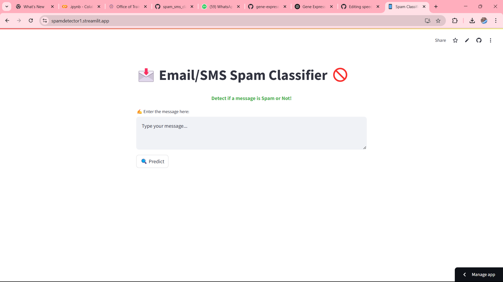
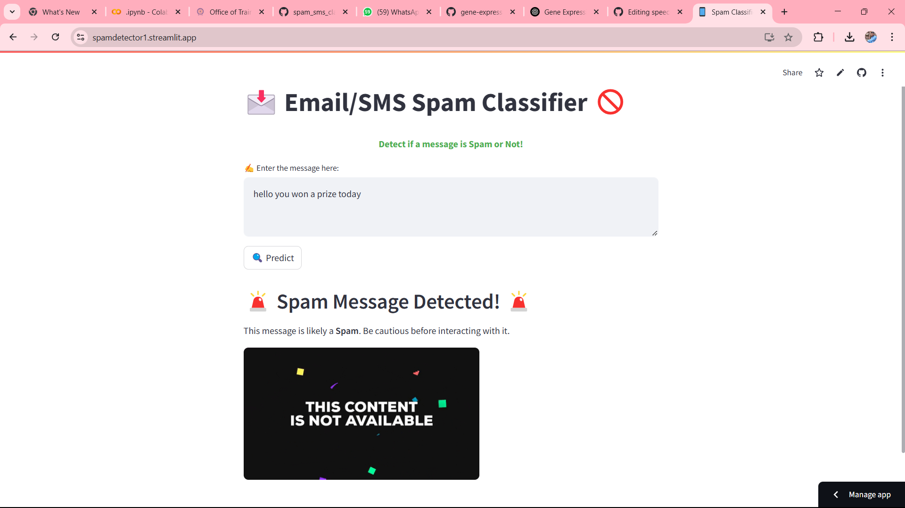

# Email/SMS Spam Classifier

This is a NLP based web application that detects if a message is **Spam** or **Not Spam**. It is built using **Streamlit** and deployed at the following link:

👉 **[Link](https://spamdetector1.streamlit.app/)**

## Features

- Enter a message to check if it is spam.
- Provides a clear and interactive UI.
- Immediate results with a spam detection alert.

## Screenshots

### Main Interface

### Spam Detected

## Usage

1. Open the [live demo link](https://spamdetector1.streamlit.app/).
2. Type a message in the input box.
3. Click **Predict** to check if the message is spam.
4. View the result displayed below the input.

